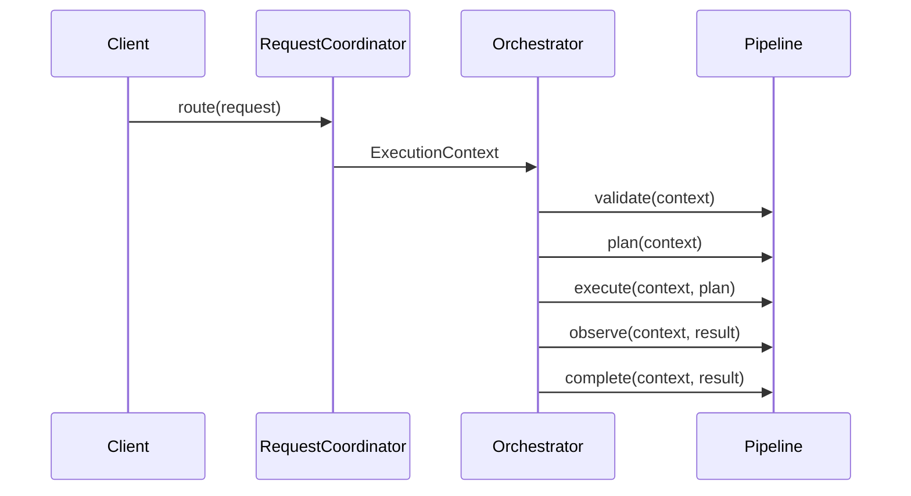

# 01. Execution Context

## Purpose

Document the current execution context model used by the orchestration layer and describe how it can evolve without replacing the existing structure.

## Current Implementation

The execution context is defined in [platform/src/orchestration/types.ts](../../platform/src/orchestration/types.ts) as `ExecutionContext`.

It currently contains:

- `request`
- `runtime`
- `brain`
- `memory`
- `knowledge`
- `worker`
- `workflow`
- `tools`

## Responsibilities

The context acts as the shared carrier for orchestration state. Its role is to make the request, runtime, and subsystem references available to the orchestrator and pipeline stages.

## Public Interfaces

The current public types are:

- `ExecutionRequest`
- `ExecutionContext`
- `ExecutionPlan`
- `ExecutionResult`
- `ExecutionState`

## Data Flow

1. A request is routed into an `ExecutionContext`.
2. The orchestrator passes the context into pipeline stages.
3. The stages read or update shared execution state through the context.

## Sequence Diagram

## Proposed Evolution

The current structure can evolve by adding optional metadata fields while preserving the existing shape. This keeps backward compatibility with the current orchestration code.

## Future Enhancements

- Add structured trace metadata.
- Add correlation and execution identifiers.
- Add optional lifecycle state extensions.

## Extension Points

- Additional optional context properties for tracing.
- Optional runtime diagnostics fields.
- Optional request-scoped metadata.

## Error Handling

Current implementation:

- No explicit error propagation in the routing layer.
- Pipeline stages are currently simple stubs.

Proposed evolution:

- Capture failures in the context.
- Surface stage-level errors without breaking caller contracts.

## Testing Strategy

- Validate that the current context shape remains compatible.
- Add tests for route-to-execution flow.
- Add regression tests for optional metadata additions.
