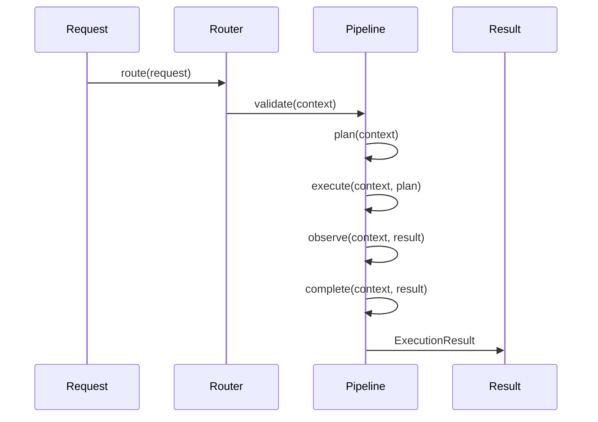

# 02. Request Pipeline

## Purpose

Describe the current request pipeline shape used by the orchestrator and how it can evolve in a backward-compatible way.

## Current Implementation

The pipeline contract is defined in [platform/src/orchestration/pipeline.ts](../../platform/src/orchestration/pipeline.ts) and implemented in [platform/src/orchestration/manager.ts](../../platform/src/orchestration/manager.ts).

The current pipeline stages are:

- `validate`
- `plan`
- `execute`
- `observe`
- `complete`
- `recover`

## Responsibilities

The request pipeline provides the ordered lifecycle for orchestration. It defines the stages that turn a request into a result.

## Public Interfaces

Relevant public interfaces:

- `ExecutionPipeline`
- `RequestRouter`
- `PipelineCoordinator`

## Data Flow

1. A request is routed to an execution context.
2. The orchestrator invokes the pipeline stages.
3. Each stage receives the context and returns a state or result.

## Sequence Diagram

## Proposed Evolution

The current pipeline can be extended by making stage implementations richer while preserving the same stage names and interfaces.

## Future Enhancements

- Add structured stage instrumentation.
- Add retry and timeout behavior.
- Add richer state transitions for failure and recovery.

## Extension Points

- Custom pipeline implementations can implement the existing interface.
- The orchestrator accepts a pipeline coordinator dependency, so new implementations can be injected without changing the public orchestrator contract.

## Error Handling

Current implementation:

- Recovery is defined but not yet used as part of execution.

Proposed evolution:

- On failure, transition through `recover` and return a recovered execution state.

## Testing Strategy

- Ensure the orchestrator still invokes all stages in order.
- Add tests for failure scenarios and recovery behavior.
- Add regression tests for injected pipeline implementations.
