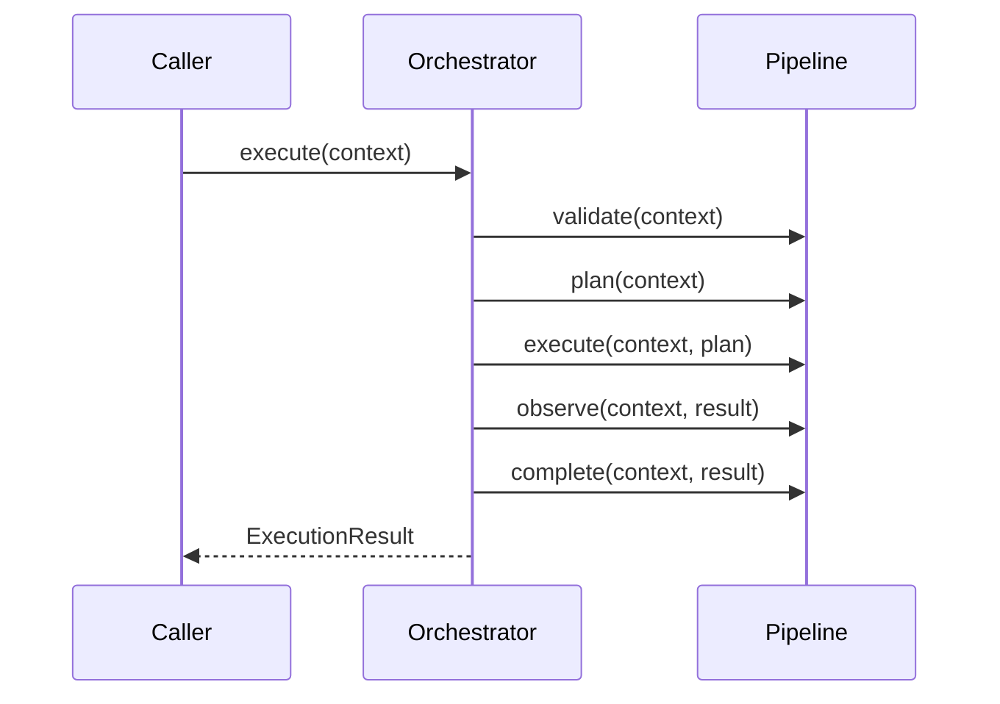

# 03. Orchestrator Core

## Purpose

Describe the current orchestrator core and how it can evolve while remaining compatible with the existing public interfaces.

## Current Implementation

The orchestrator factory is implemented in [platform/src/orchestration/manager.ts](../../platform/src/orchestration/manager.ts) and the interface is declared in [platform/src/orchestration/types.ts](../../platform/src/orchestration/types.ts).

The current orchestrator exposes:

- `execute(context: ExecutionContext): Promise<ExecutionResult>`

## Responsibilities

The orchestrator coordinates the lifecycle of a request by invoking the pipeline stages in sequence.

## Public Interfaces

Current interfaces:

- `Orchestrator`
- `PipelineCoordinator`
- `ExecutionCoordinator`

## Data Flow

1. The orchestrator receives an execution context.
2. It delegates to `validate`, `plan`, `execute`, `observe`, and `complete`.
3. It returns the final execution result.

## Sequence Diagram

## Proposed Evolution

The orchestrator can evolve by adding richer state capture, logging, and error handling around the existing lifecycle without replacing the current entry point.

## Future Enhancements

- Add lifecycle event publication.
- Add time-based metrics capture.
- Add contextual diagnostics for failed stages.

## Extension Points

- Inject custom pipeline coordinators.
- Add additional coordination responsibilities around existing lifecycle phases.

## Error Handling

Current implementation:

- No explicit recovery path is executed from the orchestrator.

Proposed evolution:

- Wrap stage execution to invoke recovery if a stage fails.

## Testing Strategy

- Validate the current happy path.
- Add failure-path tests.
- Add regression tests for injected pipeline implementations.
