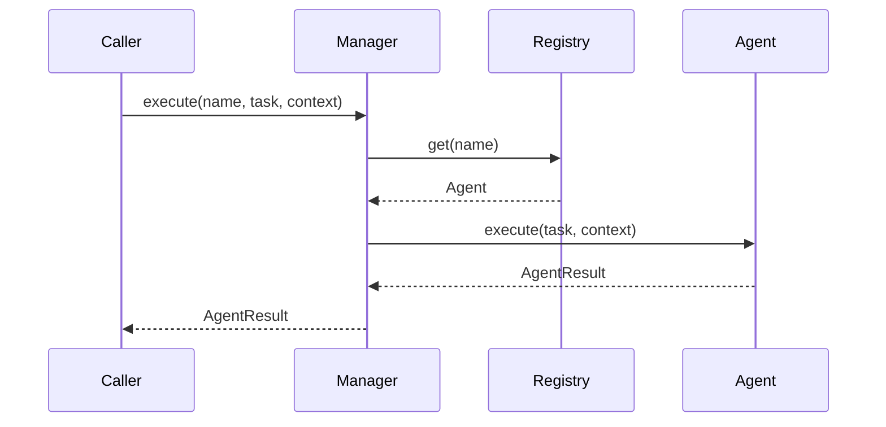

# 04. Agent Registry

## Purpose

Document the current agent registration and execution model and outline how it can evolve while maintaining compatibility with the existing API.

## Current Implementation

The agent subsystem is implemented in [platform/src/agent/manager.ts](../../platform/src/agent/manager.ts) and defined in [platform/src/agent/types.ts](../../platform/src/agent/types.ts).

Current public concepts include:

- `Agent`
- `AgentManager`
- `AgentRegistry`
- `AgentRuntime`
- `AgentTask`
- `AgentResult`

## Responsibilities

The registry stores agents by name and allows the manager to resolve and execute them when requested.

## Public Interfaces

Key interfaces:

- `AgentRegistry.register/get/list`
- `AgentManager.register/load/execute/pause/resume/stop`
- `AgentRuntime.execute`

## Data Flow

1. An agent is registered in the registry.
2. A caller requests execution by name.
3. The manager resolves the agent and invokes its `execute` method.

## Sequence Diagram

## Proposed Evolution

The registry can evolve by adding richer lifecycle and metadata support without changing the current execution model.

## Future Enhancements

- Add agent lifecycle state tracking.
- Add registration-time validation.
- Add richer execution diagnostics.

## Extension Points

- Additional runtime adapters can wrap the existing manager.
- New agent implementations can be registered under the existing interface.

## Error Handling

Current implementation:

- Throws an error when a requested agent is not registered.

Proposed evolution:

- Add structured errors for missing agents and failed executions.

## Testing Strategy

- Verify registration and lookup behavior.
- Verify execution success and missing-agent failures.
- Add regression tests for runtime adapters.
