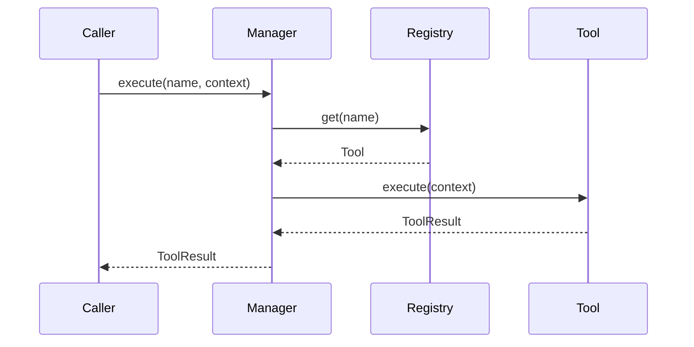

# 05. Tool Registry

## Purpose

Document the current tool registration and invocation model and show how it can evolve without replacing the existing registry-based approach.

## Current Implementation

The tool subsystem is implemented in [platform/src/tools/manager.ts](../../platform/src/tools/manager.ts) and defined in [platform/src/tools/types.ts](../../platform/src/tools/types.ts).

Current public concepts include:

- `Tool`
- `ToolRegistry`
- `ToolManager`
- `ToolExecutor`
- `ToolContext`
- `ToolResult`

## Responsibilities

The tool registry stores tools by name and exposes discovery, validation, and execution behavior.

## Public Interfaces

Relevant interfaces:

- `ToolRegistry.register/get/list`
- `ToolManager.register/discover/validate/execute`
- `ToolExecutor.execute`

## Data Flow

1. A tool is registered under a name.
2. The manager validates the tool name.
3. The manager executes the corresponding tool instance.

## Sequence Diagram

## Proposed Evolution

The current design can evolve by adding richer discovery metadata and execution diagnostics while preserving the same registry contract.

## Future Enhancements

- Add tool metadata and capability discovery.
- Add permission-aware execution hooks.
- Add execution tracing.

## Extension Points

- New tools can be registered under the existing interface.
- Tool execution can be wrapped by a new executor without changing registry consumers.

## Error Handling

Current implementation:

- Throws an error if a requested tool is not registered.

Proposed evolution:

- Add structured failures for registration and execution issues.

## Testing Strategy

- Verify registration and discovery behavior.
- Verify successful execution and missing-tool errors.
- Add regression tests for new tool implementations.
