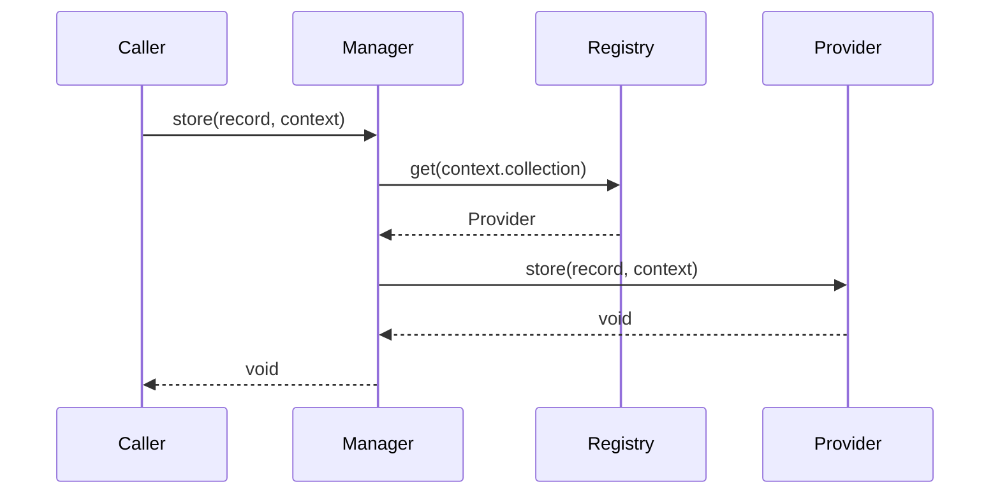

# 06. Memory Manager

## Purpose

Document the current memory manager design and describe a conservative evolution path that remains compatible with the existing repository.

## Current Implementation

The memory subsystem is implemented in [platform/src/memory/manager.ts](../../platform/src/memory/manager.ts) and defined in [platform/src/memory/types.ts](../../platform/src/memory/types.ts).

Current public concepts include:

- `MemoryProvider`
- `MemoryManager`
- `MemoryRegistry`
- `MemoryRecord`
- `MemoryContext`
- `MemorySnapshot`

## Responsibilities

The memory manager registers providers and routes storage and recall operations to the appropriate provider.

## Public Interfaces

Key interfaces:

- `MemoryRegistry.register/get`
- `MemoryManager.store/recall/search/archive/summarize/forget/expire/restore/version`

## Data Flow

1. A memory provider is registered.
2. Store or recall requests are routed through the manager.
3. The manager delegates to the selected provider when available.

## Sequence Diagram

## Proposed Evolution

The manager can evolve by adding richer provider selection and observability while preserving the existing interface methods.

## Future Enhancements

- Add provider selection heuristics.
- Add traceable memory operations.
- Add richer search and summarization behavior.

## Extension Points

- Additional providers can be registered under the current `MemoryProvider` interface.
- New memory policies can be layered over the existing manager without replacing it.

## Error Handling

Current implementation:

- Missing providers result in no-op behavior for some operations.

Proposed evolution:

- Add explicit diagnostics for missing provider configuration.

## Testing Strategy

- Verify provider registration and lookup.
- Verify store and recall paths.
- Add regression tests for missing-provider behavior.
