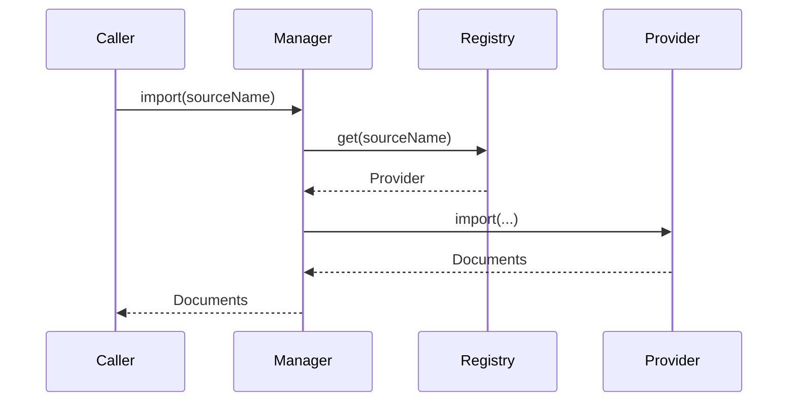

# 07. Knowledge Manager

## Purpose

Document the current knowledge management model and how it can be extended without introducing a new architecture.

## Current Implementation

The knowledge subsystem is implemented in [platform/src/knowledge/manager.ts](../../platform/src/knowledge/manager.ts) and defined in [platform/src/knowledge/types.ts](../../platform/src/knowledge/types.ts).

Current public concepts include:

- `KnowledgeDocument`
- `KnowledgeChunk`
- `KnowledgeQuery`
- `KnowledgeProvider`
- `KnowledgeManager`
- `KnowledgePipeline`

## Responsibilities

The knowledge manager coordinates providers and exposes import, indexing, search, retrieval, update, delete, and version operations.

## Public Interfaces

Key interfaces:

- `KnowledgeRegistry.register/get`
- `KnowledgeManager.import/index/search/retrieve/update/delete/version`

## Data Flow

1. A provider is registered.
2. Import or indexing requests are routed through the manager.
3. The manager delegates to the provider or the pipeline runner.

## Sequence Diagram

## Proposed Evolution

The current manager can evolve by adding richer indexing and retrieval behavior while preserving its public methods.

## Future Enhancements

- Add better retrieval ranking.
- Add metadata enrichment.
- Add richer pipeline execution stages.

## Extension Points

- New providers can be registered under the existing registry contract.
- The pipeline runner can be replaced with a richer implementation while preserving the manager API.

## Error Handling

Current implementation:

- Missing providers throw an error on import.

Proposed evolution:

- Add richer validation and reporting for failed imports and retrievals.

## Testing Strategy

- Verify provider registration and import behavior.
- Verify indexing and retrieval call flow.
- Add regression tests for missing providers and empty results.
