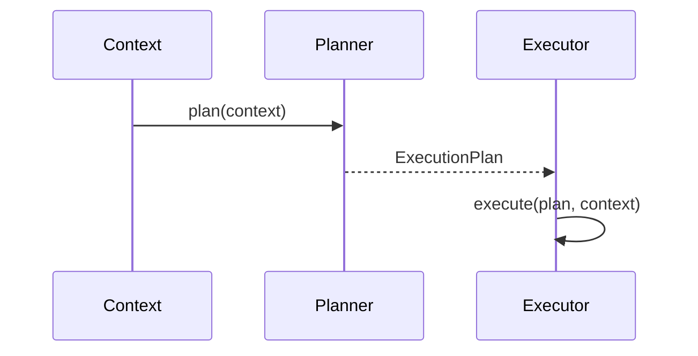

# 08. Planner

## Purpose

Document the current planning concept in the platform and how it can evolve as a backward-compatible extension of existing types.

## Current Implementation

Planning concepts appear in the brain and orchestration subsystems. The relevant types are defined in:

- [platform/src/brain/types.ts](../../platform/src/brain/types.ts)
- [platform/src/orchestration/types.ts](../../platform/src/orchestration/types.ts)

The current implementation exposes planning-related types such as `ExecutionPlan` and the brain-side `ExecutionPlan` with tasks and actions.

## Responsibilities

The planner produces a structured plan describing the work to be done. In the current repository, planning is modeled as typed data rather than a fully executed planner engine.

## Public Interfaces

The current public planning surfaces are:

- `ExecutionPlan`
- `BrainPlanner`
- `BrainExecutor`
- `BrainReasoner`

## Data Flow

1. A planning context is created from the execution environment.
2. The planner produces a structured plan.
3. The plan can be consumed by execution or reasoning components.

## Sequence Diagram

## Proposed Evolution

The planner can evolve by enriching the plan object and making it more actionable while preserving the existing plan structure.

## Future Enhancements

- Add richer task decomposition.
- Add planner diagnostics and retries.
- Add plan validation against capability constraints.

## Extension Points

- Custom planning strategies can implement the existing planner interfaces.
- The existing plan model can be extended with optional metadata without breaking consumers.

## Error Handling

Current implementation:

- Planning is not fully executed in the current orchestrator path.

Proposed evolution:

- Return explicit planning failures when required information is missing.

## Testing Strategy

- Validate plan structure generation.
- Add tests for planner failure conditions.
- Ensure backward compatibility with existing `ExecutionPlan` consumers.
