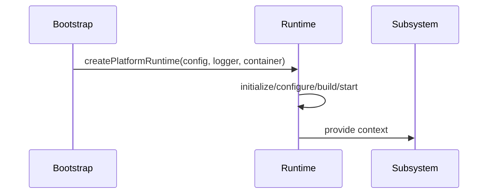

# 09. Runtime Context

## Purpose

Document the current runtime context model and how it can expand without changing the existing runtime abstractions.

## Current Implementation

The runtime context is defined in [platform/src/runtime/types.ts](../../platform/src/runtime/types.ts) and implemented in [platform/src/runtime/runtime.ts](../../platform/src/runtime/runtime.ts).

The runtime currently contains:

- `config`
- `logger`
- `container`

The platform runtime exposes lifecycle methods such as initialize, configure, build, start, ready, stop, restart, and shutdown.

## Responsibilities

The runtime context provides the execution environment for the platform. It carries configuration and supporting services used by higher-level subsystems.

## Public Interfaces

Current public types:

- `RuntimeContext`
- `PlatformRuntime`
- `Application`
- `Bootstrap`

## Data Flow

1. The runtime is created with configuration, logger, and container.
2. The runtime transitions through lifecycle stages.
3. Subsystems consume the runtime context when they are executed.

## Sequence Diagram

## Proposed Evolution

The runtime context can evolve by adding optional diagnostics and lifecycle metadata while preserving the existing methods.

## Future Enhancements

- Add richer health and readiness state.
- Add runtime event hooks.
- Add service dependency inspection.

## Extension Points

- The runtime can be extended with new lifecycle aspects without changing existing consumers.
- Additional container registrations can be supplied through the existing container abstraction.

## Error Handling

Current implementation:

- Lifecycle methods simply transition state.

Proposed evolution:

- Add explicit lifecycle failure reporting and recovery hooks.

## Testing Strategy

- Verify lifecycle transitions.
- Verify the runtime context shape.
- Add regression tests for new lifecycle metadata.
