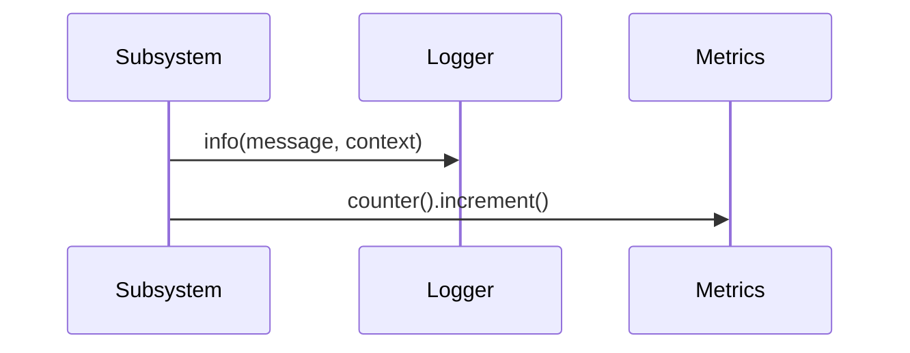

# 10. Observability

## Purpose

Document the current observability concepts available in the repository and describe how they can evolve without replacing the existing abstractions.

## Current Implementation

The observability layer is represented by [platform/src/observability/metrics.ts](../../platform/src/observability/metrics.ts) and the shared logger in [platform/src/shared/logger.ts](../../platform/src/shared/logger.ts).

Current public concepts include:

- `Metrics`
- `Counter`
- `Timer`
- `Histogram`
- `Logger`
- `LogEntry`

## Responsibilities

The observability layer provides the foundation for logging and measuring execution behavior. It is currently a general-purpose infrastructure surface.

## Public Interfaces

Relevant interfaces:

- `Metrics.counter/timer/histogram`
- `Logger.debug/info/warn/error/fatal`

## Data Flow

1. A subsystem emits log entries or metrics.
2. The logging or metrics helpers capture the event.
3. The output is surfaced through the current transport or metrics API.

## Sequence Diagram

## Proposed Evolution

Observability can evolve by wiring these hooks into the orchestration lifecycle and runtime transitions while preserving the current interfaces.

## Future Enhancements

- Add orchestration lifecycle logging.
- Add execution timing and counters for request stages.
- Add richer correlation identifiers.

## Extension Points

- New transports can be added for logging.
- New metrics collectors can be layered over the existing interface.

## Error Handling

Current implementation:

- Logging and metrics are lightweight helpers.

Proposed evolution:

- Capture failures consistently and expose them in logs or metrics.

## Testing Strategy

- Validate logger output shape.
- Validate metrics interface behavior.
- Add regression tests for logging and metrics integration points.
